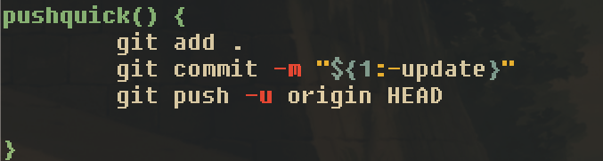

### Customization!

There are a ton  ways you can customize your terminal. 

Here's a few of my favourite configuration shcemes:

*I'm a Unix guy, so irrespective of the OS, I stay away from powershell (hence the gitbash).*

For my PC, I run gitbash (which runs mintty) with the following setup:

ThemeFile=gruvbox

Font=Fixedsys

FontHeight=16

CursorType=block

CursorBlinks=no

Transparency=medium

FontWeight=400

FontIsBold=no

Here's what it looks like 

***Protip:*** Try out a transparent terminal background, so you can see your desktop wallpaper seep through.

On my Macbook, I run ghostty and have a more complex setup: 

- zshell 
- power10k 
 

