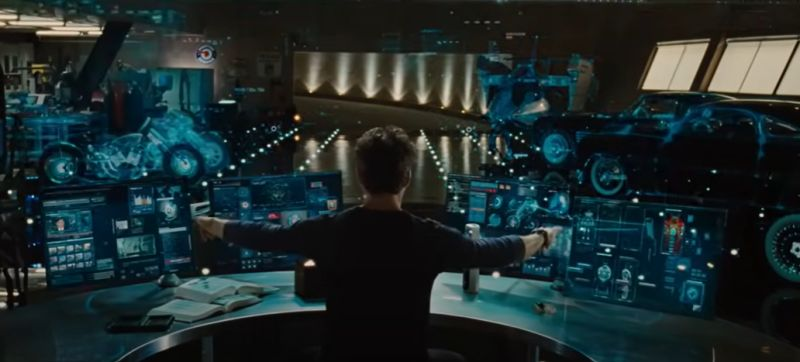

### Interfaces 

Why they're important!

A good interface is the backbone of any connection. They enable the user of a given service, product, or 'thing' to connect to another part of a system. 

In a software engineering context, an good Interface is an API thats easy to use. One that is intutive, simple, and doesn't make you want to rip your hair out.

### Weird Interfaces
I like computers. And as such, I often think of the various ways we can imporove that interface. This appracition of the computer-interface was born from Tony Stark in Iron Man 2. 

